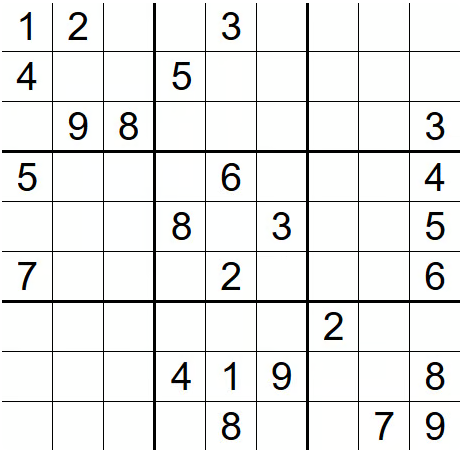

# Day 3

## 题目  1  ：Products of Array Except Self

Given an integer array `nums`, return an array `output` where `output[i]` is the product of all the elements of `nums` except `nums[i]`\.

Each product is **guaranteed** to fit in a **32\-bit** integer\.

Follow\-up: Could you solve it in*O*\(*n*\) time without using the division operation?

**Example 1:**

```Java
Input: nums = [1,2,4,6]
Output: [48,24,12,8]
```

**Example 2:**

```Java
Input: nums = [-1,0,1,2,3]
Output: [0,-6,0,0,0]
```

**Constraints:**

- `2 <= nums.length <= 1000`

- `-20 <= nums[i] <= 20`

**思路： **

服了，题目读了两遍都没看懂\- \-！

给你一个数组nums, 返回一个新的数组：output。 output\[i\]是nums里面除了第 i 个数字以外，其他所有数字的乘积。

不是求当前数字乘多少，而是排除当前数字之后，剩下所有数字相乘。

output的长度跟nums长度一致，维护一个指针 从 nums 0\-\>n计算n次。  每一次都遍历一次剩下的区间  \.

然后我又想，如果这个nums 里面没有 0的话， 那么 output\[i\]就等于 total/num\[i\]

比如nums = \[1,2,4,6\] 总数：48  output:\[48,24,12,8\]

但是nums有0的话就不能这样算了，有0的话：

① 就一个0， 那么总数等于 nums去掉这个0，再乘。  而output 就是除了0对应的index 其余都是0,0对应的位置就是总数。

②\>1个0，全部都是0\.

```Plain Text
def productExceptSelf(self, nums: List[int]) -> List[int]:
    count_zero = 0
    zero_index = -1
    total_product = 1
    length = len(nums)
    output = []
    for index,item in enumerate(nums):
        if item == 0:
            count_zero +=1    
            zero_index = index    
        else:
            total_product  = total_product  * item 
    # 两个及以上0     
    if count_zero > 1:         
        return [0] * length
    if count_zero ==1:
        output = [0] * length
        output[zero_index] = total_product
        return output 
    for index in range(length):
        output.append(total_product  /nums[index])
    return output
```

但是题目限制了。【without using the division operation】

前缀积 / 后缀积的核心：把一个大问题拆成两部分的累计结果。

nums=\[1,2,4,6\]  当i=1时候  左边：1 ， 右边 4\*6  结果 = 左边累计 × 右边累计

前缀积： 从左往右：

```Plain Text
位置0左边没有数字 -> 1
位置1左边是1 -> 1
位置2左边是1*2 -> 2
位置3左边是1*2*4 -> 8
```

prefix=\[1,1,2,8\]

后缀积：从右往左：

```Plain Text
位置3右边没有 -> 1
位置2右边是6 -> 6
位置1右边是4*6 -> 24
位置0右边是2*4*6 -> 48
```

suffix=\[48,24,6,1\]

```Plain Text
def productExceptSelf(self, nums: List[int]) -> List[int]:
    length = len(nums)
    ## 先计算前缀积
    prefix = {}
    prefix[0]=1
    for index in range(1,length):
        prefix[index]=nums[index-1] * prefix[index-1]
    print("前缀积:",prefix)
    ## 计算后缀积
    suffix = {}
    suffix[length-1] =1
    for index in range(length-2,-1,-1):
        suffix[index] = nums[index+1] * suffix[index+1]
    print("后缀积:",suffix)
    output = []
    for i in range(0,length):
        output.append(prefix[i]*suffix[i]) 
    return output
```

**解析：**

有几个优化点。 

第一个：用了 dict：

```Plain Text
prefix = {}
suffix = {}
```

这里其实不需要。因为 key，就是连续数组。

应该用 list：prefix = \[1\] \* length            suffix = \[1\] \* length

空间复杂度：prefix O\(n\)   suffix O\(n\) 可以优化。

可以复用 output 存 prefix。

第一遍：output 存左边乘积：output=\[1,1,2,8\]

第二遍：维护一个变量：  right\_product

output\[i\]=左边乘积\*右边乘积

空间： 从：O\(n\)\+O\(n\)  变成：O\(1\)

```Python
def productExceptSelf(self, nums: List[int]) -> List[int]:
    length = len(nums)
    ## 先计算前缀积
    output = [1] * length
    prefix = 1     
    for i in range(length):         
        output[i] = prefix         
        prefix *= nums[i]      
    # 计算后缀积，并累乘到 output     
    suffix = 1     
    for i in range(length - 1, -1, -1):        
        output[i] *= suffix         
        suffix *= nums[i]
    return output
```


## 题目  2  ：Valid Sudoku

You are given a `9 x 9` Sudoku board `board`\. A Sudoku board is valid if the following rules are followed:

1. Each row must contain the digits `1-9` without duplicates\.

2. Each column must contain the digits `1-9` without duplicates\.

3. Each of the nine `3 x 3` sub\-boxes of the grid must contain the digits `1-9` without duplicates\.

Return `true` if the Sudoku board is valid, otherwise return `false`

Note: A board does not need to be full or be solvable to be valid\.

**Example 1:**



```Java
Input: 
board =[
    ["1","2",".",".","3",".",".",".","."],
    ["4",".",".","5",".",".",".",".","."],
    [".","9","8",".",".",".",".",".","3"],
    ["5",".",".",".","6",".",".",".","4"],
    [".",".",".","8",".","3",".",".","5"],
    ["7",".",".",".","2",".",".",".","6"],
    [".",".",".",".",".",".","2",".","."],
    [".",".",".","4","1","9",".",".","8"],
    [".",".",".",".","8",".",".","7","9"]
]

Output: true


Input: 
board =[
    ["1","2",".",".","3",".",".",".","."],
    ["4",".",".","5",".",".",".",".","."],
    [".","9","1",".",".",".",".",".","3"],
    ["5",".",".",".","6",".",".",".","4"],
    [".",".",".","8",".","3",".",".","5"],
    ["7",".",".",".","2",".",".",".","6"],
    [".",".",".",".",".",".","2",".","."],
    [".",".",".","4","1","9",".",".","8"],
    [".",".",".",".","8",".",".","7","9"]
]

Output: false
```

**思路： **

有一个9\*9的board，满足：

1. 每一行必须包含1\~9 没有重复的

2. 每一列必须包含1\~9 没有重复的

3. 每个3\*3 子box ，必须包含1\~9 没有重复的\.

1、2 都很好满足啊 就遍历一下每一行/列 只要没有重复数字就够了。 就是第一天练习的第一个题目，Contains Duplicate

3\*3 比较麻烦 是一个滑动窗口吧？1，2,3   2,3,4  这样的。

```Plain Text
# 先写出来 重复数字的
def isValidSudoku(self, board: List[List[str]]) -> bool:
    rows = [set() for _ in range(9)]
    cols = [set() for _ in range(9)]
    boxes = [set() for _ in range(9)]

    for r in range(9):
        for c in range(9):
            num = board[r][c]

            # 空格跳过
            if num == ".":
                continue

            # 当前3x3区域编号
            box_id = (r // 3) * 3 + (c // 3)

            # 检查重复
            if num in rows[r]:
                return False

            if num in cols[c]:
                return False

            if num in boxes[box_id]:
                return False

            # 加入记录
            rows[r].add(num)
            cols[c].add(num)
            boxes[box_id].add(num)

    return True
```

