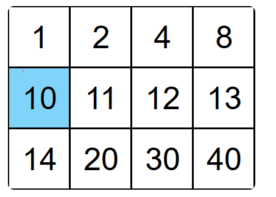
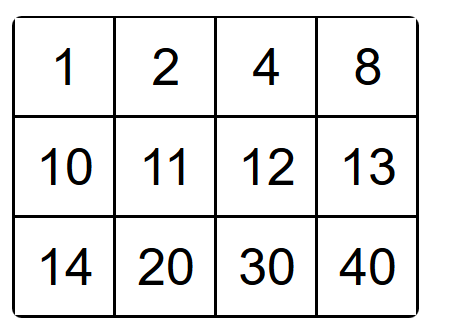

# Day 13

## 题目  1  ：Binary Search

You are given an array of **distinct** integers `nums`, sorted in ascending order, and an integer `target`\.

Implement a function to search for `target` within `nums`\. If it exists, then return its index, otherwise, return `-1`\.

Your solution must run in O\(logn\)*O*\(*logn*\) time\.

**Example 1:**

```Java
Input: nums = [-1,0,2,4,6,8], target = 4Output: 3
```

**Example 2:**

```Java
Input: nums = [-1,0,2,4,6,8], target = 3Output: -1
```

**Constraints:**

- `1 <= nums.length <= 10000`\.

- `-10000 < nums[i], target < 10000`

- All the integers in `nums` are **unique**\.


**思路：**

有一个数组列表 nums，按升序排列，由不同的整数组成。  还有一个target

写一个函数 在nums找到target。如果存在 返回index 不存在返回\-1


做搜索题，第一个肯定是 暴力搜索  O\(n\)

```Plain Text
def search(self, nums: List[int], target: int) -> int:
    for index,item in enumerate(nums):
        if item == target
            return index
    return -1
```

当然了 这个数组是有序的 递增的，那么我们可以采用二分法。

```Plain Text
def search(self, nums: List[int], target: int) -> int:
    n = len(nums)
    left = 0
    right = n-1
    
    while left <= right:
        mid =left + (right-left)//2
        if nums[mid] ==target:
            return mid
        
        if nums[mid]<target:
            left = mid+1
        if nums[mid]>target:
            right = mid-1
        
    return -1
            
    
```

O\(log n\)


## 题目  2 ：Search a 2D Matrix

You are given an `m x n` 2\-D integer array `matrix` and an integer `target`\.

- Each row in `matrix` is sorted in *non\-decreasing* order\.

- The first integer of every row is greater than the last integer of the previous row\.

Return `true` if `target` exists within `matrix` or `false` otherwise\.

Can you write a solution that runs in `O(log(m * n))` time?

**Example 1:**



```Java
Input: matrix = [[1,2,4,8],[10,11,12,13],[14,20,30,40]], target = 10Output: true
```

**Example 2:**



```Java
Input: matrix = [[1,2,4,8],[10,11,12,13],[14,20,30,40]], target = 15Output: false
```

**Constraints:**

- `m == matrix.length`

- `n == matrix[i].length`

- `1 <= m, n <= 100`

- `-10000 <= matrix[i][j], target <= 10000`


**思路：**

一个二维数组 m\*n  一个target。

Matrix的每一行升序排序。

每一行的第一个整数都比上一个row大。

如果目标值存在于矩阵中，则返回 true，否则返回 false。


说是二维，其实是一个递增的nums 转成了一个2d 罢了。

先考虑这个target  就是找到这个中间的这个row 看看这个row的首位，

如果大于这个row的最后一个 那么就去下一个row找。 如果小于这个row 第一个，那么就去上一个row\.

要求是 log\(n\*m\)  两个层次都要二分法。   

```Plain Text
def searchMatrix(self, matrix: List[List[int]], target: int) -> bool:
    row_num = len(matrix)
    left = 0
    right = row_num-1

    while left<=right:
        mid_row = left + (right-left)//2
        if target == matrix[mid_row][0] or target == matrix[mid_row][-1]:
            return True
        if target < matrix[mid_row][0]:
            right = mid_row-1
        if target > matrix[mid_row][-1]:
            left = mid_row+1
        if target>matrix[mid_row][0] and target < matrix[mid_row][-1]:
            ## target 一定在mid_row 这行，找到了 。

            break
    
    
    m = len(matrix[mid_row])
    left_row = 0
    right_row = m-1
    
    while left_row<=right_row:
        mid = left_row + (right_row -left_row )//2
        if target==matrix[mid_row][mid]:
            return True
        if target<matrix[mid_row][mid]:
            right_row = mid-1
        if target >matrix[mid_row][mid]:
            left_row = mid +1
        
    return False
```

