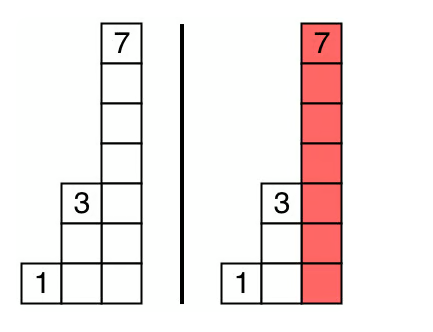
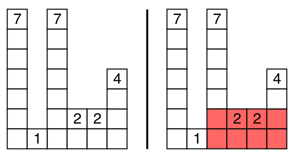

# Day 12

## 题目  1  ：Car Fleet

There are `n` cars traveling to the same destination on a one\-lane highway\.

You are given two arrays of integers `position` and `speed`, both of length `n`\.

- `position[i]` is the position of the `ith car` \(in miles\)

- `speed[i]` is the speed of the `ith` car \(in miles per hour\)

The **destination** is at position `target` miles\.

A car can **not** pass another car ahead of it\. It can only catch up to another car and then drive at the same speed as the car ahead of it\.

A **car fleet** is a non\-empty set of cars driving at the same position and same speed\. A single car is also considered a car fleet\.

If a car catches up to a car fleet the moment the fleet reaches the destination, then the car is considered to be part of the fleet\.

Return the number of **different car fleets** that will arrive at the destination\.

**Example 1:**

```Java
Input: target = 10, position = [1,4], speed = [3,2]Output: 1
```

Explanation: The cars starting at 1 \(speed 3\) and 4 \(speed 2\) become a fleet, meeting each other at 10, the destination\.

**Example 2:**

```Java
Input: target = 10, position = [4,1,0,7], speed = [2,2,1,1]Output: 3
```

Explanation: The cars starting at 4 and 7 become a fleet at position 10\. The cars starting at 1 and 0 never catch up to the car ahead of them\. Thus, there are 3 car fleets that will arrive at the destination\.

**Constraints:**

- `n == position.length == speed.length`\.

- `1 <= n <= 100,000`

- `0 < target <= 1,000,000`

- `1 <= speed[i] <= 1,000,000`

- `0 <= position[i] < target`

- All the values of `position` are **unique**\.


**思路：**

在一个高速公路上有n个汽车，给了两个数组  一个是终点一个是速度，长度都是n

position\[i\]是第i个汽车的终点，speed\[i\]是第i个汽车的速度

目的地是target 

要求：

1\.不能超车 但是可以追上另一个车然后一个速度开 （并行？）

2\.车队是一组相同位置、速度行驶的车  单车也是一个车队

3\.如果一辆车在某个车队到达目的地的瞬间追上了该车队，那么这辆车也被视为该车队的一部分。

4\.返回最终到达目的地的不同车队的数量。

Input: target = 10, position = \[1,4\], speed = \[3,2\]Output: 1

解读：（10\-1）/3=3   （10\-4）/2=3 都可以在3s时候达到 所以是同一个车队的

Input: target = 10, position = \[4,1,0,7\], speed = \[2,2,1,1\]Output: 3

解读：

\(10\-4\)/2 =3   \(10\-1\)/2 = 4\.5  10/1=10  \(10\-7\)/1=3  输出3 


\(target\-postion\[i\]\)/speed\[i\]


那么我们遍历n 遍 把这个对应的值都算出来 存在一个list里，比较一下之前有没有出现  没有就\+1  有就\+0

```Plain Text
def carFleet(self, target: int, position: List[int], speed: List[int]) -> int:
    
    n = len(position)
    result_stack = []
    for index in range(n):
        result = (target-position[index ])/speed[index ]
        if result not in result_stack :
            result_stack.append(result)
    return len(result_stack)
    
```


**优化：**

上面超时了，需要优化代码  啊哈哈哈 每次想的都是暴力啊！
同时有个错误 到达终点时间相同 = 同一个车队

真正判断条件是：

> 后面的车（位置更靠近终点）如果比前面的车先到，它不能超过前车，所以会被前车限制速度，最终合并。
> 
> 

有个限制！ 

比如 这个

```Markdown
target=12
position=[10,8,0,5,3]
speed=[2,4,1,1,3]
```

计算出来的结果是\[1,1,12,8,3\]

最后一个车在3  倒数第二个车在5  哪怕 最后一个车3s能到 也要在5的后面

那就是  在利用时间 不同的同时 也要考虑position的问题。也就是说，**车队由前方车辆决定到达时间。**

前车到终点时间是否 \>= 后车到终点时间

```Python
def carFleet(self, target: int, position: List[int], speed: List[int]) -> int:
    cars = sorted(zip(position, speed), reverse=True)
    fleet = 0    
    current_time = 0
    for pos, spd in cars:         
        # 当前车单独到达终点需要的时间         
        time = (target - pos) / spd          
        # 当前车比前面的车队慢，追不上，形成新车队         
        if time > current_time:             
            fleet += 1             
            current_time = time 
    
        # 如果 time <= current_time         
        # 说明它会追上前面的车队，不增加fleet
    return fleet
```

Car Fleet 有两种常见解法。

- **排序 \+ 维护当前最大到达时间（我刚才给你的）**

- **排序 \+ 单调栈（NeetCode/LeetCode Stack章节常讲的）**

```C++
def carFleet(self, target: int, position: List[int], speed: List[int]) -> int:

    cars = sorted(zip(position, speed), reverse=True)

    stack = []

    for pos, spd in cars:
        time = (target - pos) / spd

        if not stack or time > stack[-1]:
            stack.append(time)

    return len(stack)
```


## 题目 2：Largest Rectangle In Histogram

You are given an array of integers `heights` where `heights[i]` represents the height of a bar\. The width of each bar is `1`\.

Return the area of the largest rectangle that can be formed among the bars\.

**Note:** This chart is known as a [histogram](https://en.wikipedia.org/wiki/Histogram)\.

**Example 1:**




```Java
Input: heights = [7,1,7,2,2,4]Output: 8
```


**Example 2:**



```Java
Input: heights = [1,3,7]Output: 7
```

**Constraints:**

- `1 <= heights.length <= 100,000`\.

- `0 <= heights[i] <= 10,000`


**思路：**

一个高度数组，i\-th个代表了bar的高度，宽度都是1\.返回由这些柱状条所能构成的最大矩形的面积。

面积有两个因素，  s=area\*height

最大矩形不一定以某个最高柱子作为高度。

一个柱子能扩展多宽，不是由它自己决定，而是由**左右第一个比它矮的柱子决定**。

一段连续区间的矩形高度，由这段区间里的最低柱子决定。

单调栈保存：**还没有找到右边更矮柱子的柱子下标。**

```Plain Text
def largestRectangleArea(self, heights: List[int]) -> int:
    stack = []     
    max_area = 0
    
    ## 这个 0 是为了强制把剩余柱子全部弹出来计算。
    heights.append(0)
    
    for i,h in enumerate(heights)
        # 找到了右边 更矮的柱子下标
        while stack and h<heights[stack[-1]):
            height = heights[stack.pop()]
            
            if stack:
                width = i-stack[-1] -1
            else:
                width = i
            max_area = max(max_area,height*width)
        stack.append(i)
    return max_area 
    
    
以heights = [7,1,7,2,2,4] 为例子
heights = [7,1,7,2,2,4,0]

i=0  h=7  stack=[]
    stack空跳过
    stack=[0]

i=1 h=1  stack=[0]
    height = heights[0] = 7
    width =1
    max_area = max(0,7)=7
    stack=[1]
i=2 h=7  stack=[1]
    7>1  跳过
    stack=[1，2]
i=3 h=2  stack=[1，2]
    heights[stack[-1])=7    2<7:
    heigth = 7  stack=[1]
    width =3-1-1 = 1
    max_area = max(7,7)=7
    
    stack=[1，3]
i = 4  h=2  stack=[1，3]
    heights[stack[-1]) = 2
    
    stack = =[1，3,4]

i=5 h= 4 stack=[1，3,4]
    heights[stack[-1]) = 2
    stack = [1，3,4,5]
i = 6 h=0 stack = [1，3,4,5]
     heights[stack[-1]) =4
     heigth = 4      stack = [1，3,4]
     width = i-stack[-1] -1 = 6-4-1=1
     max_area = 7
     
     heights[stack[-1]) =2
     heigth = 2   stack = [1，3]
     width = 6-3-1 = 2
     max_area =    7
     
     heights[stack[-1]) =2
     heigth = 2   stack = [1]
     width = 6-1-1 = 4
     max_area = 8
     
     heights[stack[-1]) =1
     
     stack = =[1，6]
     

```


