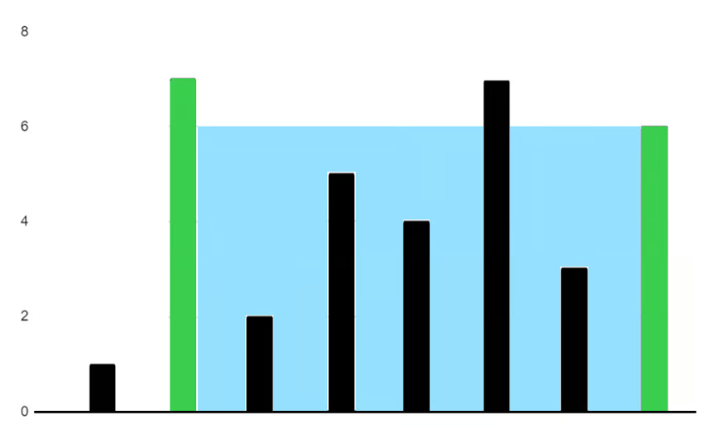
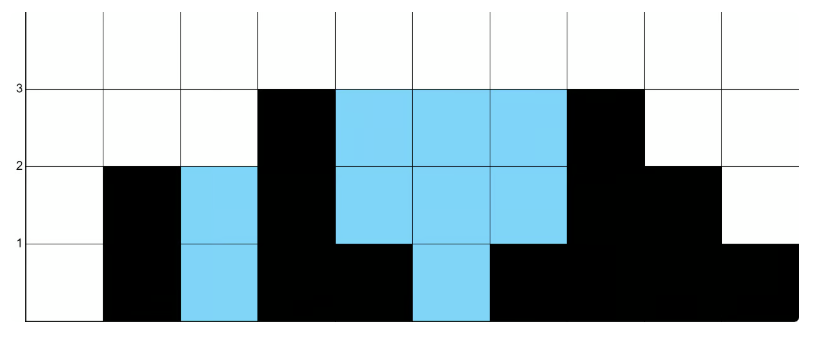

# Day 6

## 题目  1  ：Container With Most Water

You are given an integer array `heights` where `heights[i]` represents the height of the ith*ith* bar\.

You may choose any two bars to form a container\. Return the *maximum* amount of water a container can store\.

**Example 1:**




```Java
Input: height = [1,7,2,5,4,7,3,6]Output: 36
```

**Example 2:**

```Java
Input: height = [2,2,2]Output: 4
```

**Constraints:**

- `2 <= height.length <= 1000`

- `0 <= height[i] <= 1000`

**思路： **

heights 数组， 第i个值代表着 第i个柱子的高度。要求就是任意选择两个柱子，算出这个容器能容纳的最大水量。

最大容水量，高度是由选择的两根柱子矮的那根决定的，所以高度要求最大的话 就最好是找到两根柱子 一个第一高 一个第二高，这个是高。 但是长也很重要 也就是index2\-index1最大。

面积等于  \(index2\-index1\)\*min\(index1,index2\)

每当看到这种题，我脑子里第一想法总是暴力解题法orz。就固定一个index 遍历剩下的 全部都算一遍 留一个最大的\. 

```Plain Text
def maxArea(self, heights: List[int]) -> int:
    
    max_area = 0
    length_list = len(heights)
    for index,item in enumerate(heights):
        i = index+1
        while i<=length_list -1:
            length = i-index
            heigth = min(heights[i],item)
            area = length * heigth
            max_area = max(max_area ,area)
            i = i+1
    return max_area 
```


**解析：**

暴力解题逻辑没有问题，但是效率不行。可以考虑双指针问题。

比如 \[1,7,2,5,4,7,3,6\]   left,right 分别一左一右。 Area = \(right\-left\)\*min\(left,right\)

怎么移动呢？当一边是短板时，移动长板不可能得到更优解。当前宽度已经是最大的。之后想提高面积，只能靠提高高度。

如果左边的矮，left\<right  高度 min  =1

移动右边 宽度减了1，高度最多还是1，所以应该左移动。

```Plain Text
def maxArea(self, heights: List[int]) -> int:
    max_area = 0
    left=0 
    right=len(heights)-1
    while left<right:
        area =  (right-left)*min(heights[left],heights[right])
        if heights[left]<heights[right]:
            left = left+1
        else:
            right = right-1 
        max_area = max(max_area ,area)  
    return  max_area 
```

## 题目  2  ：Trapping Rain Water

You are given an array of non\-negative integers `height` which represent an elevation map\. Each value `height[i]` represents the height of a bar, which has a width of `1`\.

Return the maximum area of water that can be trapped between the bars\.

**Example 1:**



```Java
Input: height = [0,2,0,3,1,0,1,3,2,1]Output: 9
```

**Constraints:**

- `1 <= height.length <= 1000`

- `0 <= height[i] <= 1000`

**思路： **

非负整数数组 height，表示一个高程图，每个值height\[i\] 代表一个柱状图的高度，返回柱状图最大水面积。

这个题跟前一个要分清 前一个就是两个柱子是矩形，这个是一排不同高度的柱子组成一个地形，凹进去的地方积水。

在选边界的时候第一个不为0的作为left, 找right就是找到一个顶峰，也就是\>=left and right\+1\<right  

也就是如果这个序列从这个index开始是递减/递增的就没有池子。  池子必须是递增后递减。

1\.要找到 底点和顶点

2\.顶点——底点——顶点才是池子。

暴力：遍历每一个位置 i，左最大、右最大，然后累加水量。

```Plain Text
def trap(self, height: List[int]) -> int:
    total = 0
    water = 0
    for index,item in enumerate(heigths):
        left_max = max(height[:index+1])
        right_max = max(height[index:])
        water = min(left_max,right_max)-height[index]
        total += water 
    return total 
```


